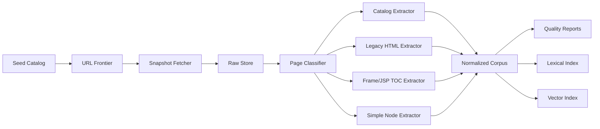

# Scraping And Index Architecture

## Target System

The knowledge store should serve a smart Tamil chat agent for poets, researchers, and Tamil language lovers. The store should support:

- exact citation to source page
- retrieval by poem line, work title, poet, deity/place, genre, meter, and theme where available
- Tamil lexical search
- semantic retrieval over poems, commentary, glossary entries, and metadata
- future enrichment with transliteration, morphology, named entities, and scholarly annotations

## Pipeline



## Storage Layers

### Raw Snapshot Store

Path: `data/raw`

One immutable record per fetched URL:

- canonical URL
- fetched URL
- HTTP status, headers, content hash, fetch timestamp
- raw body bytes
- detected encoding
- parent URL and crawl reason

This lets us improve parsing without hitting TamilVU repeatedly.

### Manifest Database

Path: `data/processed/manifest.duckdb`

Tracks:

- URL frontier
- fetch state
- content hashes
- page type
- discovered links and assets
- extraction status and parser version

DuckDB is enough for local analysis and can export Parquet later.

### Normalized Corpus

Path: `data/processed/corpus.jsonl` or partitioned Parquet

Core entity types:

- `collection`: broad group such as சமய இலக்கியங்கள் or சங்க இலக்கியம்
- `work`: book/work, e.g. திருப்புகழ், பன்னிரு திருமுறைகள்
- `section`: canto, தொகுதி, திருமுறை, படைவீடு, chapter, or tree branch
- `literary_unit`: poem, hymn, verse group, glossary node, commentary passage
- `asset`: image, table, PDF, or linked non-HTML file

### RAG Indexes

Path: `data/indexes`

- lexical index: Tamil-aware BM25/full-text search
- vector index: embeddings over structure-aware chunks
- metadata filters: genre, period, work, author, deity/place, source family, page type

## Extraction Contract

Each normalized record should contain:

```json
{
  "id": "stable-content-id",
  "type": "literary_unit",
  "title": "திருப்புகழ்...",
  "text": "normalized Tamil text",
  "html": "optional preserved fragment",
  "language": "ta",
  "source_url": "https://www.tamilvu.org/...",
  "source_path": ["நூல்கள்", "சமய இலக்கியங்கள்", "சைவம்"],
  "work": "திருப்புகழ்",
  "section": "மூன்றாம் படைவீடு - பழநி",
  "authors": [],
  "commentary_authors": [],
  "tags": [],
  "assets": [],
  "crawl": {
    "fetched_at": "ISO-8601",
    "content_hash": "sha256"
  },
  "quality": {
    "parser": "legacy_html_v1",
    "confidence": 0.0,
    "warnings": []
  }
}
```

## Disk Space Estimate

The catalog exposes several hundred library links, and each work may expand to dozens or hundreds of legacy/content pages. A cautious phase-one estimate:

| Layer | Pilot | Full HTML/text corpus | With images/assets |
| --- | ---: | ---: | ---: |
| Raw HTML snapshots | 50-200 MB | 1-4 GB | 5-20 GB |
| Normalized text/metadata | 10-50 MB | 300 MB-2 GB | 300 MB-2 GB |
| DuckDB manifest/reports | 10-100 MB | 200 MB-1 GB | 200 MB-1 GB |
| Lexical index | 20-100 MB | 500 MB-3 GB | 500 MB-3 GB |
| Vector index | 100-500 MB | 2-10 GB | 2-10 GB |
| Total working store | 250 MB-1 GB | 4-20 GB | 10-40 GB |

Recommended initial allocation: **50 GB** for raw snapshots, processed outputs, indexes, and reprocessing headroom.

If high-resolution page images, PDFs, manuscript scans, or multiple embedding models are retained, reserve **100 GB+**.

## Open Decisions

- Confirm legal/copyright terms and acceptable crawling policy before bulk scraping.
- Decide whether to include all TamilVU library categories or start with poems/devotional works only.
- Decide whether scanned/image-only works are in scope for OCR.
- Pick first embedding model after testing Tamil retrieval quality.
- Decide whether the production store should be DuckDB + local indexes, PostgreSQL + pgvector, or object storage + managed vector DB.

