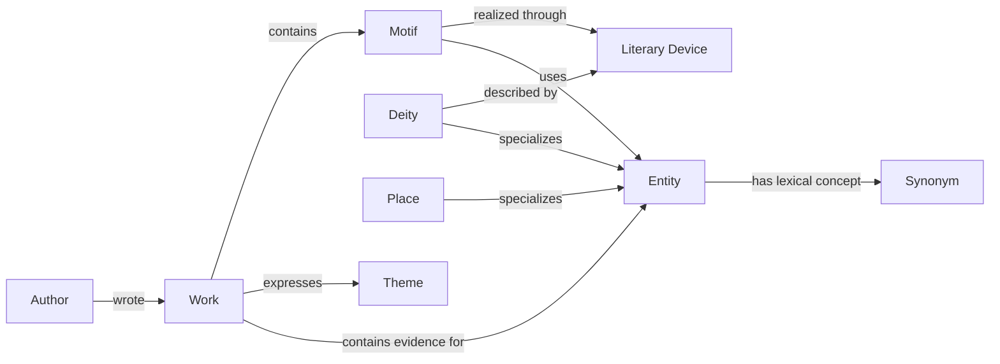

# Knowledge Architecture

## Layer Structure

```text
Knowledge Layer
├── Entity Registry
├── Synonym Registry
├── Motif Registry
├── Author Registry
├── Deity Registry
├── Place Registry
├── Work Registry
├── Theme Registry
└── Literary Device Registry
```

## Registry Responsibilities

- **Entity Registry:** general canonical entities not better represented by a specialist
  authority, including natural objects, people, and concepts.
- **Synonym Registry:** concept-level literary terms, spelling variants, and lexical forms.
- **Motif Registry:** recurring narrative or imagery patterns that may span works.
- **Author Registry:** canonical author identity, aliases, period, and linked works.
- **Deity Registry:** canonical divine identities, names, traditions, attributes, and
  reviewed epithets.
- **Place Registry:** canonical literary and sacred places with source-name variants.
- **Work Registry:** stable literary work identity independent of a particular web page or
  edition.
- **Theme Registry:** broad interpretive subjects such as devotion, love, impermanence, or
  heroism.
- **Literary Device Registry:** device types such as simile, metaphor, epithet, allusion,
  and personification.

## Relationships



Registry records define identities. A later annotation layer will define occurrences:

```text
knowledge_id -> annotation_id -> corpus record_id -> text span -> source_url
```

This separation prevents illustrative registry seeds from being mistaken for corpus
evidence.

## Design Rules

- IDs are stable, human-readable, and never random.
- Tamil canonical forms are preserved in NFC Unicode.
- Aliases and synonyms do not overwrite source wording.
- Every extracted relationship must later carry evidence and review metadata.
- One term may participate in several roles; context decides whether `பிறை` is an entity,
  deity attribute, motif, or metaphor.
- Registry releases and annotation releases must be independently versioned.
