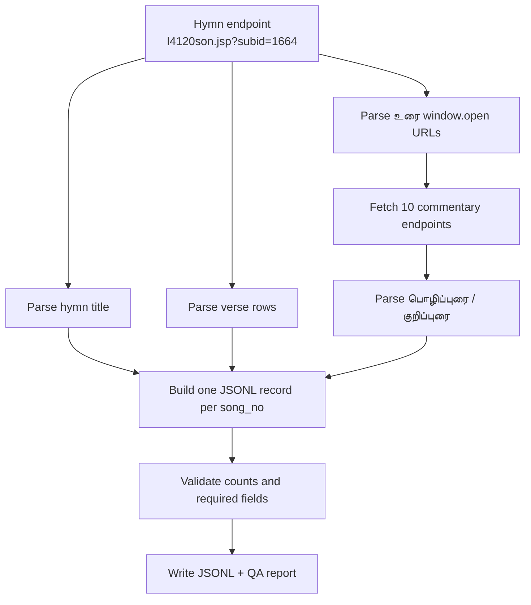

# One-Hymn Pilot Scraper

This pilot scraper extracts exactly one TamilVU hymn:

- Hymn: `திருப்பூந்தராய் - வினா உரை - இந்தளம்`
- Hymn endpoint: `https://www.tamilvu.org/slet/l4120/l4120son.jsp?subid=1664`
- Commentary endpoint pattern: `l4120uri.jsp?song_no={song_no}&book_id=110&head_id=60&sub_id=1664`

It is not a full-site scraper.

## What The Pilot Extracts

For each verse/song in the selected hymn, the pilot extracts:

- hymn/pathigam title
- `sub_id`
- `book_id`
- `head_id`
- `song_no`
- verse text
- commentary URL
- பொழிப்புரை
- குறிப்புரை
- hymn source URL
- commentary source URL

The pilot writes one JSONL record per verse/song:

`data/processed/pilot/thevaram_hymn_1664.jsonl`

It also writes a QA report:

`reports/pilot-hymn-1664-report.md`

## What It Does Not Extract Yet

- It does not crawl all 124 hymn links.
- It does not crawl other Thirumurai pages.
- It does not infer scholarly metadata beyond the known pilot constants.
- It does not build a RAG index.
- It does not use browser automation.
- It does not use GCP.

## Data Flow

## Assumptions

- `sub_id` / `subid` identifies the hymn/pathigam.
- `song_no` identifies the verse/song.
- `book_id=110` and `head_id=60` are stable for this inspected hymn.
- The hymn endpoint contains all verse text.
- Commentary pages are statically extractable with `requests` + BeautifulSoup.
- The labels `பொழிப்புரை:` / `பொ-ரை:` and `குறிப்புரை:` / `கு-ரை:` can be used to split commentary text. The parser also accepts semicolon variants such as `பொ-ரை;`.

## Validation Rules

- Exactly 10 commentary URLs are expected.
- At least 10 verse records are expected.
- Each record must have `song_no`.
- Each record must have `verse_text`.
- Each record should have `commentary_url`.
- If `pozhppurai` or `kurippurai` is empty, `extraction_status` must not be `success`.

## Known Limitations

- The verse parser is tailored to the inspected table layout.
- Commentary splitting depends on visible Tamil labels and currently supports the full and abbreviated forms seen in the pilot pages.
- Some commentary pages may contain additional notes after `குறிப்புரை`; in this pilot, they are included in `kurippurai`.
- Later generalization should preserve raw HTML and add layout-specific parser versions.
