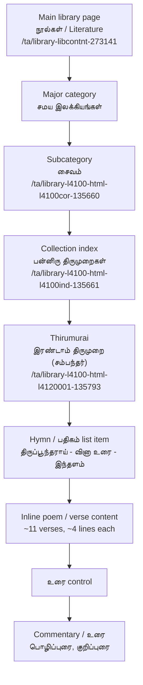

# TamilVU Site Inspection Phase

This document captures the manual inspection of the TamilVU literature path from the main library page down to individual poem and commentary content. It is not a scraping plan by itself; it defines what the scraper must understand before a pilot scrape.

Seed URL:

`https://www.tamilvu.org/ta/library-libcontnt-273141`

## Observed Page Structure

The TamilVU "நூல்கள் / Literature" main page has three major visual columns:

- Left: "நூல்கள் / Literature" with around 14 categories.
- Middle: around 8 subcategories such as Roman literature, dictionaries, and related resources.
- Right: "நாட்டுடைமை நூல்கள்" with around 5 subcategories.

Under the left-side category "சமய இலக்கியங்கள்", the observed subcategories are:

- சைவம்
- வைணவம்
- கிறித்தவம்
- இஸ்லாம்

Clicking "சைவம்" opens:

`https://www.tamilvu.org/ta/library-l4100-html-l4100cor-135660`

The Saivam page has 5 categories:

- பன்னிரு திருமுறைகள்
- கந்தபுராணம்
- கல்லாடம்
- திருவிளையாடற் புராணம்
- திருப்புகழ்

Clicking "பன்னிரு திருமுறைகள்" opens:

`https://www.tamilvu.org/ta/library-l4100-html-l4100ind-135661`

That page has 12 categories, collectively known as பன்னிரு திருமுறைகள்.

Selecting "இரண்டாம் திருமுறை (சம்பந்தர்)" opens:

`https://www.tamilvu.org/ta/library-l4100-html-l4120001-135793`

This page contains many பதிகம் / hymn entries, including examples such as:

- திருப்பூந்தராய் - வினா உரை - இந்தளம்
- திருவலஞ்சுழி - வினாஉரை - இந்தளம்
- திருத் தெளிச்சேரி - வினாஉரை - இந்தளம்

Important behavior: selecting a hymn entry may not navigate to a separate page. The poem content appears inline on the same page, to the right side of the hymn list. For the example hymn "திருப்பூந்தராய் - வினா உரை - இந்தளம்", around 11 poems/verses are shown. Each poem has around 4 lines.

Next to each poem there is an "உரை" icon/link. It opens or reveals commentary sections such as:

- பொழிப்புரை
- குறிப்புரை

## Hierarchy Diagram



## Page Types Discovered So Far

### Main Library/Category Page

Example: `/ta/library-libcontnt-273141`

Role:

- Presents the top-level literature catalog.
- Contains multiple visual category columns.
- Links to major literary families.

Extraction needs:

- top-level categories
- visible Tamil/English labels
- internal TamilVU links
- visual grouping when detectable from DOM structure

### Subcategory Page

Example: `/ta/library-l4100-html-l4100cor-135660`

Role:

- Represents a religious/literary subcategory such as சைவம்.
- Links to major works or collections within that subcategory.

Extraction needs:

- subcategory title
- parent category
- collection links

### Collection Index Page

Example: `/ta/library-l4100-html-l4100ind-135661`

Role:

- Lists the 12 திருமுறை categories under பன்னிரு திருமுறைகள்.

Extraction needs:

- collection title
- ordered thirumurai links
- author/deity/style hints in link text when present

### Thirumurai Index Page

Example: `/ta/library-l4100-html-l4120001-135793`

Role:

- Lists many பதிகம் / hymn entries for a selected திருமுறை.
- May also host inline content for selected hymns.

Extraction needs:

- thirumurai title and number
- hymn/pathigam entries
- tune/meter labels such as இந்தளம் when present
- inline content containers

### Hymn List/Content Page

Example: same URL as the Thirumurai index page after selecting a hymn.

Role:

- Displays the hymn list and the selected hymn content on the same page.

Extraction needs:

- selected hymn title
- place/sthalam name
- hymn-level metadata split from link text
- poem/verse blocks
- same-page navigation state if encoded in links, anchors, query params, JavaScript, or AJAX

### Inline Poem/Commentary Content

Example: "திருப்பூந்தராய் - வினா உரை - இந்தளம்" content and its "உரை" links.

Role:

- Contains poem/verse text and commentary revealed through an inline control.

Extraction needs:

- verse order
- verse lines
- "உரை" control/link references
- commentary type: பொழிப்புரை, குறிப்புரை
- commentary text
- relation from commentary back to exact verse

## Data Units To Extract

- `collection`: a broad family such as சமய இலக்கியங்கள் or பன்னிரு திருமுறைகள்.
- `subcollection`: a narrower branch such as சைவம் or திருப்புகழ்.
- `thirumurai`: numbered canonical division, e.g. இரண்டாம் திருமுறை.
- `hymn_pathigam`: a பதிகம்/hymn entry such as திருப்பூந்தராய் - வினா உரை - இந்தளம்.
- `poem_verse`: a single numbered poem/verse within a hymn.
- `commentary_urai`: commentary associated with a verse or hymn, such as பொழிப்புரை or குறிப்புரை.

## Preliminary Corpus Schema

### Work/Collection Record

```json
{
  "id": "collection:l4100:panniru-thirumurai",
  "record_type": "collection",
  "title_ta": "பன்னிரு திருமுறைகள்",
  "title_en": null,
  "parent_id": "subcollection:l4100:saivam",
  "category_path": ["நூல்கள்", "சமய இலக்கியங்கள்", "சைவம்"],
  "source_url": "https://www.tamilvu.org/ta/library-l4100-html-l4100ind-135661",
  "legacy_url": null,
  "order": null,
  "metadata": {
    "observed_page_type": "collection_index_page"
  }
}
```

### Hymn/Pathigam Record

```json
{
  "id": "hymn:l4120:thiruppoontharai-vina-urai-indhalam",
  "record_type": "hymn_pathigam",
  "title_ta": "திருப்பூந்தராய் - வினா உரை - இந்தளம்",
  "work_id": "collection:l4100:panniru-thirumurai",
  "thirumurai_id": "thirumurai:l4120:2",
  "place_ta": "திருப்பூந்தராய்",
  "genre_or_form_ta": "வினா உரை",
  "tune_or_meter_ta": "இந்தளம்",
  "source_url": "https://www.tamilvu.org/ta/library-l4100-html-l4120001-135793",
  "content_mode": "same_page_inline",
  "verse_count_observed": 11,
  "metadata": {
    "author_ta": "சம்பந்தர்"
  }
}
```

### Poem/Verse Record

```json
{
  "id": "verse:l4120:thiruppoontharai:001",
  "record_type": "poem_verse",
  "hymn_id": "hymn:l4120:thiruppoontharai-vina-urai-indhalam",
  "sequence": 1,
  "text_ta": "verse text with original line breaks",
  "lines_ta": ["line 1", "line 2", "line 3", "line 4"],
  "source_url": "https://www.tamilvu.org/ta/library-l4100-html-l4120001-135793",
  "source_anchor": null,
  "has_commentary": true,
  "quality": {
    "line_count": 4,
    "parser_confidence": 0.0,
    "warnings": []
  }
}
```

### Commentary Record

```json
{
  "id": "commentary:l4120:thiruppoontharai:001:pozhippurai",
  "record_type": "commentary_urai",
  "verse_id": "verse:l4120:thiruppoontharai:001",
  "hymn_id": "hymn:l4120:thiruppoontharai-vina-urai-indhalam",
  "commentary_type_ta": "பொழிப்புரை",
  "text_ta": "commentary text",
  "source_url": "https://www.tamilvu.org/ta/library-l4100-html-l4120001-135793",
  "source_anchor": null,
  "display_mode": "inline_revealed_by_urai_control",
  "quality": {
    "parser_confidence": 0.0,
    "warnings": []
  }
}
```

## Inspection Questions For The Next Phase

- Does same-page content already exist in the initial HTML, or is it loaded by JavaScript after a click?
- Are hymn entries encoded as anchors, buttons, image links, JavaScript calls, or form controls?
- Do "உரை" controls point to hidden DOM content, same-page anchors, separate URLs, or JavaScript handlers?
- Can verse order be derived from visible numbering or DOM order?
- Are பொழிப்புரை and குறிப்புரை separate DOM sections or labels inside one commentary block?

