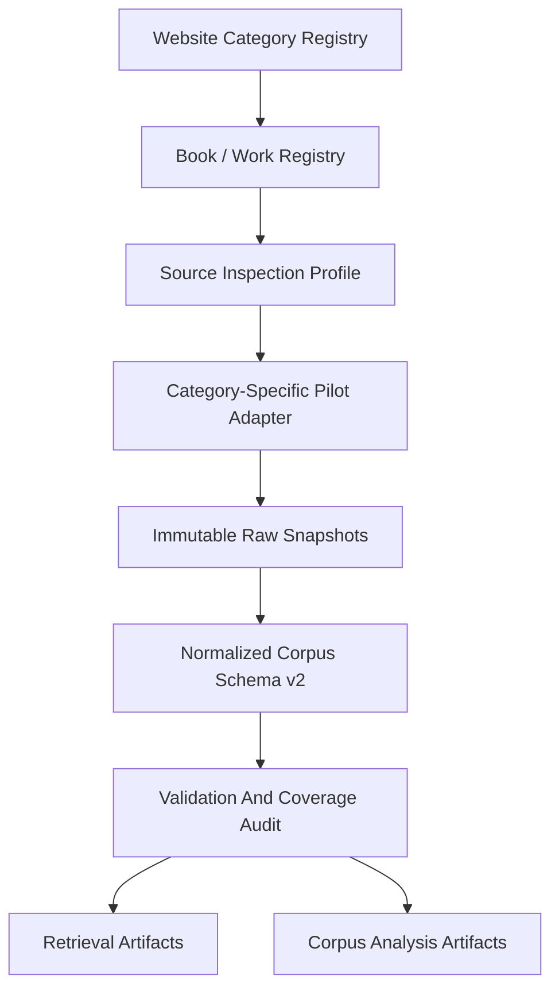

# Website-Wide Tamil Corpus Architecture

## Scope

The final product is a Tamil Literary KnowledgeHub over the TamilVU library, not a Thirumurai-only RAG system. Irandaam Thirumurai and the bounded Fourth Thirumurai sample are valuable because they proved source inspection, static extraction, commentary separation, normalization, retrieval, citation, and audit workflows. They represent one collection family inside a much larger website.

The website includes poetry, prose, grammar, dictionaries, lexicons, encyclopedias, terminology tables, manuscripts, image books, cultural galleries, public-domain books, romanized texts, and external-library references. These materials cannot share one page parser or one literary hierarchy.

## Architectural Levels

### Website Category

A category is a navigational and planning surface such as சங்க இலக்கியம், இலக்கணம், அகராதிகள், or சுவடிக்காட்சியகம். It defines expected content type and parser family, but is not itself a book.

### Book Or Work

A book registry record identifies one source work, edition, author, period, rights note, source URL, available formats, parser family, and ingestion state. A work may have multiple source URLs or formats.

### Corpus Record

A corpus record is the smallest independently citable unit appropriate to its source:

- poem, hymn, or verse
- prose paragraph or section
- grammar sutra/rule and example
- dictionary or nigandu headword/sense
- encyclopedia article
- manuscript/image page metadata
- external library reference

## Parser Families

| Parser Family | Typical Units |
| --- | --- |
| `verse_parser` | poem, hymn, verse, poet, meter/pann, commentary |
| `prose_parser` | book, chapter, section, paragraph, page |
| `grammar_parser` | sutra/rule, explanation, example, commentary |
| `dictionary_parser` | headword, sense, grammar label, example, cross-reference |
| `table_parser` | row/column terminology, numeric or tabular indexes |
| `image_metadata_parser` | manuscript/image page, caption, asset URL, folio metadata |
| `mixed_parser` | works combining poetry, prose, commentary, tables, or media |
| `external_link_registry` | title, institution, URL, scope, policy note |

Parser family is an architectural contract, not a promise that every page in a category has identical HTML. Each pilot must still inspect actual page families.

## Structural Differences

Poetry depends on source order, stanza boundaries, poet, meter, place, and commentary. Prose depends on chapters, headings, paragraphs, pages, notes, and illustrations. Grammar works require rule/example/explanation separation. Dictionaries require headword and sense boundaries rather than arbitrary chunks. Encyclopedias need article and cross-reference structures. Manuscripts need metadata and asset provenance before any OCR. External links are references, not locally scraped books.

Flattening these into one `text` field would destroy the evidence needed by poets, researchers, students, and future corpus analysis.

## Existing Thirumurai Work

The current Thirumurai registry remains intact as `collection_family = "thirumurai"`.

- `thirumurai_02` remains fully available with its frozen and retrieval-ready artifacts.
- `thirumurai_04` remains an available, `pilot_verified` five-hymn sample.
- Unified Thirumurai schema v1 remains valid for those artifacts.
- Schema v2 is a superset design for future website-wide normalization; it does not rewrite frozen records.

Future migration should derive v2 records from released artifacts and preserve stable IDs and citations.

## Why Full Scraping Is Deferred

Website-wide scraping is unsafe before:

1. category and book discovery are separated from content crawling;
2. rights, public-domain, and source-policy notes are recorded per book;
3. each parser family has a small allowlisted pilot;
4. coverage, Unicode, hierarchy, and citation audits pass;
5. image/PDF/OCR costs and quality are measured;
6. crawl limits, retry policy, and storage estimates are approved.

The category registry is therefore a planning inventory, not a crawl frontier.

## Future Cloud Shape

Local JSONL and raw snapshots remain the development truth. A later Google Cloud phase can map the same boundaries to:

- Cloud Storage prefixes for raw, normalized, reports, and releases;
- Cloud Run Jobs for bounded category/book ingestion;
- Pub/Sub or Cloud Tasks only if controlled scheduling later requires them;
- BigQuery or object-backed analytical tables for corpus-wide aggregation;
- separately versioned lexical/vector artifacts;
- Secret Manager and least-privilege service accounts.

No always-on service or managed vector database is required for architecture validation. Cloud adoption follows proven local pilots and budget controls.
